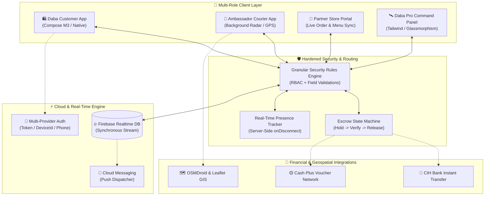
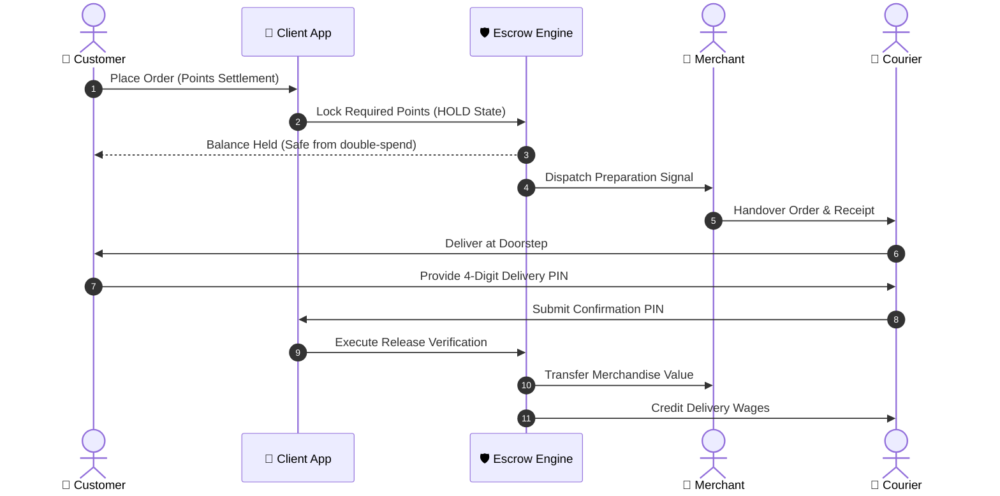

<div align="center">

<a href="https://dabaapp.web.app" target="_blank">
  
</a>

# ⚡ DABA APP (دابا) 🇲🇦
### *The Next-Gen On-Demand Hyperlocal Delivery & FinTech Super-App*

[](https://developer.android.com)
[](https://kotlinlang.org)
[](https://developer.android.com/jetpack/compose)
[](https://firebase.google.com)
[](#-enterprise-grade-security-architecture)
[](LICENSE)

<br/>

[](https://dabaapp.web.app/)
[](https://www.instagram.com/daba.app)
[](https://www.tiktok.com/@daba.app)
[](https://web.facebook.com/dabaapp)
[](https://www.linkedin.com/in/boudehbi-anouar/)

<br/>

> **"Bridging Hyperlocal Commerce, Real-Time Fleet Logistics, and Instant Digital Currency for the Moroccan Economy."**

[🎬 Video Showcase](#-product-walkthrough--video-showcase-عرض-فيديو-توضيحي) • [Explore Features](#-core-ecosystem-pillars) • [System Architecture](#-system-architecture) • [Security Model](#-enterprise-grade-security-architecture) • [Tech Stack](#-technology-stack) • [FinTech Engine](#-daba-pay--fintech-engine)

---

</div>

<br/>

## 🎬 Product Walkthrough & Video Showcase (عرض فيديو توضيحي)

<div align="center">

<video src="public/Unpacking The Daba App.mp4" controls width="100%" style="max-width: 820px; border-radius: 16px; border: 2px solid #D4AF37; box-shadow: 0 12px 36px rgba(0,0,0,0.6);" poster="daba_animated_logo.gif">
  <p>Your browser does not support HTML5 video. <a href="public/Unpacking_the_Daba_App.mp4">Click to view or download the showcase video</a>.</p>
</video>

<br/><br/>

> 📱 **Unpacking the DABA APP Ecosystem**  
> *A high-impact walkthrough unveiling Customer Instant Ordering, Real-Time Fleet Radar Telemetry, Merchant Live Portals, and Daba Pay FinTech Engine.*

<br/>

[](https://dabaapp.web.app/Unpacking_the_Daba_App.mp4)
[](public/Unpacking_the_Daba_App.mp4)

</div>

<br/>

---

## 🌐 Executive Overview

**DABA APP** is a unified, high-performance hyperlocal delivery and digital exchange ecosystem engineered from the ground up for the Moroccan market. Built with native Android technologies (**Kotlin + Jetpack Compose**) and a distributed **Real-Time Database Gateway**, DABA connects customers, certified merchants, freelance couriers (*Ambassadors*), and central fleet command in sub-second synchronization.

Beyond classical food and grocery delivery, DABA features **Daba Pay** — a proprietary zero-fee peer-to-peer point exchange system with strict escrow mechanics, dynamic pricing, live courier radar telemetry, and a multi-tiered administrative command center.

---

## 🏛️ System Architecture

The ecosystem relies on an asynchronous event-driven architecture designed for high concurrency, zero transaction collisions, and sub-100ms UI latency.



---

## 💎 Core Ecosystem Pillars

### 1. 🛍️ The Customer Super-App (تطبيق الزبون)
* **Omni-Category Open Ordering:** Order anything (food, pharmacy, supermarkets, artisan goods) via intuitive text or high-fidelity voice notes.
* **Progressive Spending Caps & Tier Progression:** Real-time gamified tier advancement based on completed orders:
  * 🌱 **Bronze / Starter:** 60–120 DH cap (protects couriers against fraudulent orders).
  * 🥈 **Silver Explorer:** 180 DH cap + 15% discount coverage.
  * 🥇 **Gold VIP:** 250 DH cap + 20% discount coverage + Priority dispatch.
  * 👑 **DABA VIP Club (PLUS / PRO / ELITE):** Monthly subscriptions with zero service fees, golden verification badges, and up to 500 DH order thresholds.
* **4-Way Flexible Hybrid Settlement:**
  1. Full Cash on Delivery (COD).
  2. 100% Digital Points (Wallet Pay).
  3. Hybrid-A: Products via Points, Delivery Fee in Cash.
  4. Hybrid-B: Delivery Fee via Points, Products in Cash.
* **Live Courier Telemetry:** Real-time geospatial tracking powered by OSMDroid with dynamic ETA recalculation.

---

### 2. 🛵 The Ambassador Fleet App (تطبيق السفير)
* **Foreground Radar Service:** Background system service with `WakeLock` capabilities to alert couriers of incoming orders within a customizable geo-radius even when the device is locked.
* **Smart Dynamic Delivery Pricing:** Distance-based routing and vehicle-type optimization (Motorcycle 🛵, Bicycle 🚲, Scooter 🛴, Walking 🚶‍♂️).
* **Automated Debt Cap Control (سقف الديون):** Automatically pauses dispatch when a courier's collected platform commissions exceed threshold limits until settlement.
* **Zero-Leak WhatsApp Dispatch:** Automatic merchant dispatch generation with full order payload and ETA while obfuscating customer personal identifiers for privacy.
* **Mandatory Call-to-Confirm Protocol:** Enforces active order validation and digital receipt capture prior to store pickup.

---

### 3. 🏪 The Partner Portal (بوابة الشركاء والمتاجر)
* **Real-Time Interactive Menu Builder:** Instant modification of dishes, prices, categories, and availability with zero app re-compilation.
* **Showcase Mini-Card Visibility:** Administrative control to flag certified stores directly onto the app's home carousel.
* **Digital Escrow Validation:** One-click confirmation of point-based payments backed by instant ledger reflection.

---

### 4. 🛰️ Daba Pro Command & Control Dashboard (لوحة التحكم المركزية)
* **Executive Real-Time KPIs:** Live counts of active riders, orders in flight, gross platform volume, and treasury balances.
* **Automated Staff Shift & Attendance Engine:**
  * Sub-second online/offline state detection powered by server-side `.onDisconnect` hooks.
  * Multi-session work duration aggregation (morning/evening shifts tracked distinctly).
  * Auto-offline detector mitigating connection drops and battery death.
* **Geospatial Order Density Heatmaps:** Live visual representation of order volume across metropolitan areas (Rabat, Salé, etc.).
* **Financial Ledger & Cash-Out Gateway:** Systematic approval and reconciliation workflow for bank wires and voucher distributions.

---

## 💸 Daba Pay & FinTech Engine

Daba Pay introduces a decentralized, peer-to-peer micro-currency pegged strictly to the Moroccan Dirham:

$$\mathbf{10\ Points = 1.00\ MAD\ (DH)}$$

| Operation | Fee Rate | Settlement Speed | Guarantee |
|:---|:---:|:---:|:---|
| **P2P Phone Transfer** | `0.00%` | Instant (< 200ms) | Final & Irreversible |
| **Merchant Store Payment** | `0.00%` | Instant | Escrow Protected |
| **Cash In via Field Agents** | Flat +0.50 DH / 500 Pts | Cash-to-Digital Sync | Authorized Receipt Required |
| **CIH Bank Withdrawal** | Nominal Tiered (2–10 DH) | Same-Day Wire | Cryptographic TxRef Audit |
| **Cash Plus Agency Cash-Out** | Standard Regulatory Fee | Real-Time Voucher | Verified CIN Identity |

### 🔒 Two-Phase Escrow Transaction Flow


---

## 🛡️ Enterprise-Grade Security Architecture

Security in DABA APP is implemented across code, network, and database layers following a **Zero-Trust Client** philosophy:

* **Role-Based Access Control (RBAC):** Strict hierarchy partitioning `SUPER_ADMIN`, `OPERATIONS`, `FINANCE`, `PARTNERS_MANAGER`, `SUPPORT`, and `EMERGENCY_COORDINATOR` roles.
* **Server-Side Security Enforcement:** All sensitive nodes in Firebase are guarded with declarative schemas:
  * No mass data scraping: Wildcard read access is blocked on customer, ambassador, and financial ledgers.
  * Deep validation rules: Point recharges and transfers strictly enforce positive integers, valid enum states, and required metadata.
* **Multi-Factor Administrative Guard:** Two-factor authorization (PIN + Email Signature verification) on all administrative and payout actions.
* **Replay & Tampering Prevention:** Transactions utilize atomic database operations (`runTransaction`) to completely eliminate race conditions and double-spending.
* **ProGuard / R8 Obfuscation:** Release binaries are compiled with strict code shrinking and identifier obfuscation.

---

## 🛠️ Technology Stack

```
DABA-ECOSYSTEM/
├── Mobile (Android Native)
│   ├── Language:           Kotlin 2.0+ (100% Coroutines & Flow)
│   ├── Architecture:       MVVM + Clean Architecture + Repository Pattern
│   ├── UI Framework:       Jetpack Compose (Material Design 3)
│   ├── Asynchronous:       Kotlin Coroutines, StateFlow, SharedFlow
│   ├── Image Loading:      Coil (Async Image Pipeline)
│   ├── Geospatial:         OSMDroid, Google Play Services Fused Location
│   └── Background Ops:     Android Foreground Services, BroadcastReceivers, WakeLocks
│
├── Web Command Panel (Daba Pro)
│   ├── Framework:          Vanilla JavaScript (ES6+ Modular, Zero Bloat)
│   ├── Styling:            Tailwind CSS + Custom Glassmorphism Theme
│   ├── Telemetry:          Leaflet.js Geospatial Heatmaps & Mapping
│   └── Realtime Sync:      Firebase Web SDK (Live WebSocket Stream)
│
└── Infrastructure & Cloud
    ├── Database:           Firebase Realtime Database (Clustered)
    ├── Authentication:     Firebase Auth (Phone SMS, Anonymous, Email)
    ├── Notifications:      Firebase Cloud Messaging (FCM HTTP v1)
    └── Security:           Granular JSON Rules, App Check, Escrow Validation
```

---

## 🚀 Getting Started (Development Setup)

### Prerequisites
* **Android Studio Ladybug (2024.2+)** or later
* **JDK 17** (or Android Studio bundled JBR)
* **Android SDK 34** (Target SDK 34, Min SDK 24)
* A valid `google-services.json` registered under your Firebase project

### Clone & Build
```bash
# Clone the showcase repository
git clone https://github.com/dabaapp/dabaappshowcase.git
cd dabaappshowcase

# Set your Java Environment (Windows PowerShell example)
$env:JAVA_HOME = "C:\Program Files\Android\Android Studio\jbr"

# Build debug APK
./gradlew assembleDebug

# Compile and verify Kotlin sources
./gradlew compileDebugKotlin
```

---

## 🌐 Connect & Community (تواصل معنا)

<div align="center">

### 📱 Official Daba App Channels
| Platform | Handle / Link | Purpose |
|:---|:---|:---|
| 🌐 **Official Portal** | [dabaapp.web.app](https://dabaapp.web.app/) | Official Web Platform, Merchant Partnerships & Info |
| 📸 **Instagram** | [@daba.app](https://www.instagram.com/daba.app) | Daily Stories, Partner Spotlights & Live Updates |
| 🎵 **TikTok** | [@daba.app](https://www.tiktok.com/@daba.app) | Reels, Street Culture & Behind-the-Scenes |
| 📘 **Facebook Page** | [dabaapp](https://web.facebook.com/dabaapp) | Official Announcements & Community News |

<br/>

### 👨‍💻 Founder & Lead System Architect
**Anouar Boudehbi** — *Founder, Lead System Architect & Mobile Engineer*

<br/>

[](https://www.linkedin.com/in/boudehbi-anouar/)
[](https://web.facebook.com/anwar.boudehbi.1)
[](https://dabaapp.web.app/)

<br/><br/>

*Designed and built with ❤️ in Morocco 🇲🇦 for the empowerment of local merchants and independent delivery ambassadors.*

<br/>

<sub>Copyright © 2026 DABA APP Ecosystem. All rights reserved.</sub>

</div>
